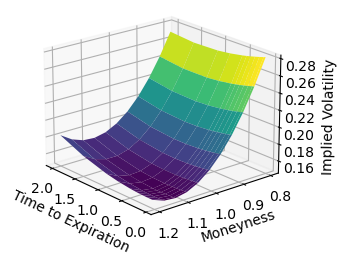
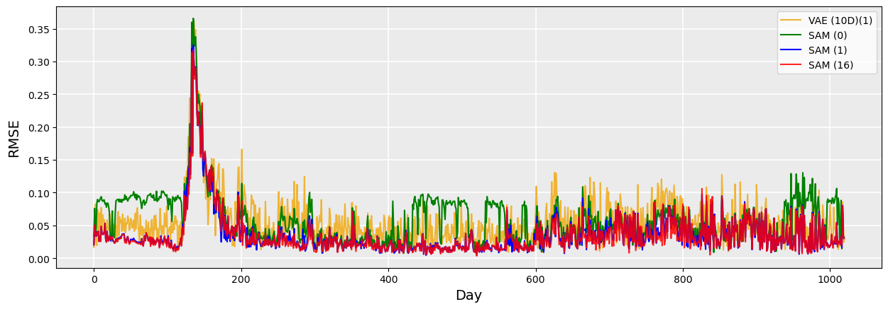
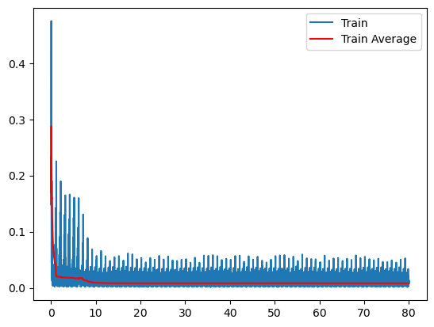

# Arbitrage-Free Prediction of the Implied Volatility Surface with Temporal Attention Strategy

## Overview

This repository contains the code and resources for the honors thesis titled "Arbitrage-Free Prediction of the Implied Volatility Surface with Temporal Attention Strategy." The project focuses on developing a model to predict the future Implied Volatility Surface (IVS) for options on the SPDR S&P 500 ETF (SPY), ensuring that these predictions are free from static arbitrage.

The core methodology involves:
1.  **Feature Extraction:** Comparing two approaches:
    *   A Variational Autoencoder (VAE) to create a lower-dimensional latent representation of the IVS.
    *   Direct sampling of IVS points.
2.  **Exogenous Data Integration:** Incorporating 10 exogenous market features (e.g., VIX levels, SPY volume, day of the week/month) to provide broader market context.
3.  **Prediction Model:** Utilizing a Long Short-Term Memory (LSTM) neural network enhanced with a multi-head temporal attention mechanism.
4.  **Arbitrage-Free Enforcement:** Employing a Deep Neural Network (DNN) to adjust the predicted IVS, ensuring it adheres to no-static-arbitrage conditions.

The study found that the IVS sampling approach, when combined with the multi-head temporal attention mechanism, yielded superior predictive capability.

## Key Visualizations

Here are some visualizations from the research:

*   **Example Implied Volatility Surface:**
    
*   **Model Performance Comparison (RMSE):**
    
*   **LSTM Training Loss (Sampling Method):**
    

*(More visualizations can be found in the `visualizations/` directory.)*

## Repository Structure & Notebooks

The project is organized into a series of Jupyter notebooks, executed in sequence:

*   `S1_IVS_construction.ipynb`: Constructs the Implied Volatility Surface from raw options data.
*   `S2_surface_sampling.ipynb`: Implements methods for sampling points from the IVS.
*   `S3_STD_IVS_viz.ipynb`: Visualizes the constructed standard IVS.
*   `S4_IVS_ARB_Break_viz.ipynb`: Visualizes instances of arbitrage breaks in the IVS.
*   `S5_train_VAE.ipynb`: Trains the Variational Autoencoder for feature extraction.
*   `S6_grab_exogenous_variables.ipynb`: Gathers and preprocesses exogenous market variables.
*   `S7_train_LSTM.ipynb`: Trains the LSTM with multi-head temporal attention for IVS prediction.
*   `S8_statarb_free_DNN.ipynb`: Trains the Deep Neural Network to ensure static arbitrage-free predictions.
*   `S9_testing.ipynb`: Conducts out-of-sample testing and evaluates the performance of the complete model pipeline using metrics like RMSE, MAPE, and MDA.

## Research Paper

The full honors thesis detailing the methodology, results, and discussion can be accessed here:
*   [Arbitrage-Free Prediction of the Implied Volatility Surface with Temporal Attention](https://repository.lib.fsu.edu/islandora/object/fsu:961091)

## Technologies Used
* Python 3
* Jupyter Notebooks
* PyTorch (torch, torch.nn, torch.utils.data, torch.optim, torch.autograd)
* torchvision (for transforms)
* Pandas
* NumPy
* scikit-learn (StandardScaler, MinMaxScaler)
* Matplotlib / Seaborn
* IPython (for display utilities)
* pickle (for data serialization)

## Future Work
Potential areas for future research include:
*   Exploring advanced attention mechanisms, such as pruning attention heads or transformer-based systems.
*   Investigating additional exogenous variables for improved market sentiment capture.

---